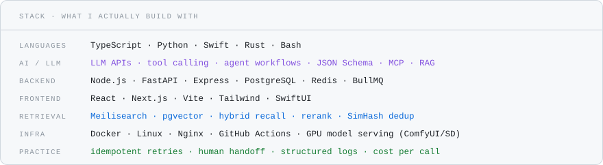

<!-- ============================================================ -->
<!-- qilai (tytsxai) — GitHub Profile                            -->
<!-- Every visual is generated by scripts/gen_assets.py          -->
<!-- ============================================================ -->

  <picture>
    <source media="(prefers-color-scheme: dark)" srcset="assets/hero-dark.svg" />
    
  </picture>

  <a href="https://t.me/cangqilai123"><b>Telegram @cangqilai123</b></a> ·
  <a href="mailto:wwtvn1937@gmail.com">Email</a> ·
  <a href="https://x.com/cangqilai888">X</a> ·
  <a href="https://github.com/tytsxai?tab=repositories">All repos</a>

  I take AI from a whiteboard idea to a production system a real business runs on — design, build, deploy, operate. 
  把 AI 从方案设计一路做到生产落地并长期稳定运行：0→1 独立负责，交付即可用。

  <b>qilai / tytsxai</b> · AI Forward Deployed Engineer (FDE) · China · GMT+8 · open source under <a href="https://github.com/tytsxai?tab=repositories">tytsxai</a> 
  Keywords: AI FDE · LLM engineering · multi-agent · RAG · production AI · self-hosted bots · automation · Telegram tooling

---

POSITION

## Open to work · 求职意向

Looking for **AI Forward Deployed Engineer (FDE)**, AI application engineering, LLM / agent engineering, or intelligent automation. Onsite in China or fully remote, worldwide.

**Who this profile is for / 适合谁：** hiring managers and founders evaluating an FDE who ships production AI systems end-to-end — not demos only.

- Born in the 2000s. Four years of hands-on AI engineering — shipped systems, not slideware.
- I own the whole line: solution design → build → deploy → operate. Several production systems still running.
- Depth in agents, multi-agent orchestration, RAG, automation matrices, evals, observability, cost control.
- Frontier tech with a cost ceiling. Token and infra spend is a requirement I design against, not an afterthought.
- Results-oriented, and honest about two-way fit. Send me the problem rather than the job description.

<b>中文版</b>

 

00 后，目前在国内，寻找**国内或远程**的 AI Forward Deployed Engineer（FDE）、AI 应用落地、LLM 开发、多 Agent 系统、智能自动化岗位。护照正常，可出差、可出境。

**4 年 AI 实战经验**，擅长从 0 到 1 独立负责，从方案设计一直做到生产落地，已交付多个长期稳定运行的项目。熟悉 Agent 编排、多 Agent 协作、RAG 检索增强、自动化矩阵等方向。注重前沿技术与成本控制的平衡，能高效把 AI 转化为可衡量的实际价值。

结果导向，希望加入真正做事的结果导向团队，双向匹配。欢迎直接私信：Telegram [@cangqilai123](https://t.me/cangqilai123)。

---

THE ROLE

## Where the model meets the customer

An FDE works in the gap between a model that demos well and a customer whose reality is messy. Four years of closing that gap:

| The job really is | What that looks like in my work |
| --- | --- |
| Sit with the customer, find the real workflow | I start from the operator's critical path and failure modes, not from the model |
| Build a working system in days, not quarters | 0→1 solo delivery: design → MVP → docs → CI → production |
| Survive contact with production | Dry runs, review gates, rate limits, retries, rollback paths, structured logs |
| Keep unit economics sane | Model routing, caching, batching, context budgeting, cheap-model-first tiering |
| Hand it over so it keeps running | Bilingual runbooks, deploy scripts, systemd and CI, redaction gates |
| Cross language and culture | Native Chinese, working English, bilingual docs as a default habit |

---

EVIDENCE

## Selected work

Public, runnable, maintained. Stars are users, not followers.

| Project | What it is | What it proves |
| --- | --- | --- |
| [**IDM-Activation-Script-Chinese**](https://github.com/tytsxai/IDM-Activation-Script-Chinese) | Windows batch toolkit · GPL-3.0 · ~1k stars · 75 forks | Distribution and maintenance at real scale — issue load, GBK/CP936 encoding traps, registry backup, environment self-check |
| [**PromptPanel**](https://github.com/tytsxai/PromptPanel) | macOS prompt and snippet launcher for AI power users · Swift/SwiftUI | Product thinking applied to the LLM workflow itself · local-first UX · release-readiness CI |
| [**bilibili-cleaner**](https://github.com/tytsxai/bilibili-cleaner) | Bulk account cleanup · FastAPI + Web UI + Typer CLI + Docker | Destructive automation done safely: QR login, rate limits, review gates, pytest CI |
| [**macfriends-cli**](https://github.com/tytsxai/macfriends-cli) | WeChat relationship detection on macOS · Rust + ObjC++ agent | Systems depth: native agent, ABI-pinned reverse work, strictly local execution |
| [**anyreality-resi-stack**](https://github.com/tytsxai/anyreality-resi-stack) | Self-hosted sing-box infra: installer, subscription server, dual-node routing | Infra and ops delivery: bilingual runbook, systemd units, secret-redaction CI |
| [**bazi-master**](https://github.com/tytsxai/bazi-master) | Full-stack AI divination platform · React + Express + PostgreSQL + Prisma | LLM inside a product: interpretation pipelines, multi-module domain logic, full-stack ownership |
| [**x-account-cleaner**](https://github.com/tytsxai/x-account-cleaner) | Local-first X/Twitter cleanup CLI · TypeScript + Playwright | Browser automation with a review-first, irreversible-action-aware model |
| [**telegram-ui-builder**](https://github.com/tytsxai/telegram-ui-builder) · [demo](https://tytsxai.github.io/telegram-ui-builder/) | Visual designer for bot messages, inline keyboards, multi-screen flows | Developer-facing tooling with a deployed demo and Pages CI |

A meaningful share of my work is private client and production systems — agent pipelines, ops automation, data workflows. Happy to walk through the architecture and the trade-offs in a call.

---

TOOLS

  <picture>
    <source media="(prefers-color-scheme: dark)" srcset="assets/stack-dark.svg" />
    
  </picture>

---

METHOD

## How I deliver

**Start from the workflow, not the model.** Who runs it, what breaks, and what "done" means in their numbers.

**Smallest useful loop first.** A runnable thin slice in days, then harden against the friction that actually shows up.

**Treat risky actions as first-class.** Dry run, confirm, limit, log, roll back. Visible failure beats silent failure.

**Measure before claiming.** Evals, reproduction steps, real runs. "Verified" and "should work" are different words.

**Package for the next person.** Docs, deploy scripts, CI, and runbooks, so it outlives my involvement.

---

WORK

## Selected work

  <picture>
    <source media="(prefers-color-scheme: dark)" srcset="assets/work-dark.svg" />
    
  </picture>

  <picture>
    <source media="(prefers-color-scheme: dark)" srcset="assets/languages-dark.svg" />
    
  </picture>

  Every visual here is generated from the GitHub API by <a href="scripts/gen_assets.py">scripts/gen_assets.py</a> and refreshed weekly by <a href=".github/workflows/charts.yml">CI</a>. Self-hosted on purpose: third-party card services go rate-limited and render as broken images, and a profile that breaks is a profile that says the wrong thing.

---

CONTACT

## Get in touch

**Telegram [@cangqilai123](https://t.me/cangqilai123)** — fastest. Also [email](mailto:wwtvn1937@gmail.com), [X](https://x.com/cangqilai888), [V2EX](https://www.v2ex.com/member/qilai).

Send the problem, not the JD. Within a message or two I'll tell you whether I can actually solve it and roughly how.

最快联系方式：Telegram [@cangqilai123](https://t.me/cangqilai123)。直接说要解决什么问题就行，我会告诉你能不能做、大概怎么做。

  AI is only worth something once it survives production. Automation is only worth something while it stays under control.

