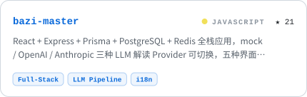
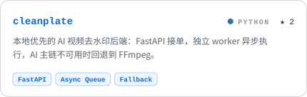
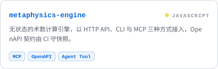
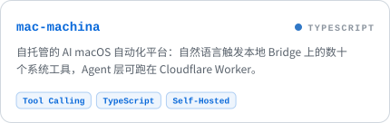
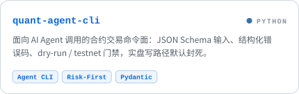
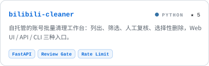
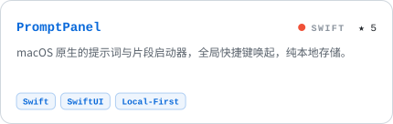
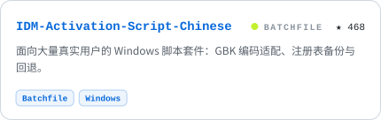
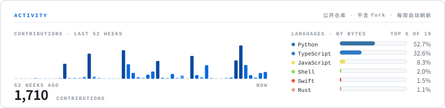

<!--
  qilaidev / 绮莱 — GitHub 主页
  · 所有卡片由 scripts/gen_assets.py 生成为自托管 SVG，CI 每周一刷新；正文不写会随时间漂移的数字。
  · 联系方式只放邮箱。
-->

  <picture>
    <source media="(prefers-color-scheme: dark)" srcset="assets/hero-dark.svg" />
    
  </picture>

绮莱（qilai），软件工程师，常驻 GMT+8 时区，开放远程全职、合同制及技术咨询机会。联系邮箱：[wwtvn1937@gmail.com](mailto:wwtvn1937@gmail.com)。

专注 AI 应用工程化落地与全栈系统交付，具备 4 年 AI 落地实战经验，覆盖 LLM 应用、AI Agent、多 Agent 系统与智能自动化，可独立完成从需求分析、架构设计、开发实现、AI 能力集成、部署上线到持续迭代的全流程交付，并有真实生产环境项目经验。当前重点方向包括 AI FDE（Forward Deployed Engineering）、AI 应用工程、企业级 AI Agent、多 Agent 系统与智能自动化。同时进行独立研发与提示词工程实践，正在将过去 4 年的 AI 落地经验沉淀为可复用的工程模板与 Agent 构建范式。

核心能力涵盖 LLM 与 Agent 的关键技术：工具调用、结构化输出、上下文管理、RAG、任务编排及多 Agent 协作。工程实践重点为状态持久化、异步状态机、幂等重试机制与异常兜底，目标是交付可承受实际流量、可观测、易排障的系统。技术栈以 TypeScript、React、Electron、Python、FastAPI、PostgreSQL、Redis 为主，具备全栈开发与系统工程能力。技术选型不追求新颖性，优先考虑稳定性、可维护性、成本与业务回报。工程原则：不追新，追稳；构建有韧性的系统，让 AI 在生产环境中存活；把混沌拆成系统，把系统交给机器。

## 技术栈

  <picture>
    <source media="(prefers-color-scheme: dark)" srcset="assets/stack-dark.svg" />
    
  </picture>

| 层 | 主力 | 也在用 |
| --- | --- | --- |
| 语言 | TypeScript、Python | JavaScript、Rust、Swift、Bash |
| 前端与客户端 | React、Electron | Vite、Tailwind CSS、shadcn/ui、SwiftUI、浏览器扩展 |
| 后端 | FastAPI、Node.js / Express | Prisma、SQLAlchemy、Pydantic、程序化 CLI |
| 数据 | PostgreSQL、Redis | SQLite、pgvector、全文检索 |
| AI / LLM | Anthropic API、OpenAI API、MCP、工具调用、结构化输出、RAG、多 Agent 编排 | Claude Code、Provider 抽象与 mock 回退、ComfyUI 工作流 |
| 基础设施 | Docker、GitHub Actions、Linux、Nginx | Cloudflare Workers / Tunnel、自托管部署 |
| 自动化与质量 | Telegram Bot API、Playwright、pytest、Vitest | 类型检查与 lint 门禁、OpenAPI 契约快照 |

## 项目

  <a href="https://github.com/qilaidev/bazi-master"><picture><source media="(prefers-color-scheme: dark)" srcset="assets/project-bazi-master-dark.svg" /></picture></a>
  <a href="https://github.com/qilaidev/cleanplate"><picture><source media="(prefers-color-scheme: dark)" srcset="assets/project-cleanplate-dark.svg" /></picture></a>

  <a href="https://github.com/qilaidev/metaphysics-engine"><picture><source media="(prefers-color-scheme: dark)" srcset="assets/project-metaphysics-engine-dark.svg" /></picture></a>
  <a href="https://github.com/qilaidev/mac-machina"><picture><source media="(prefers-color-scheme: dark)" srcset="assets/project-mac-machina-dark.svg" /></picture></a>

  <a href="https://github.com/qilaidev/quant-agent-cli"><picture><source media="(prefers-color-scheme: dark)" srcset="assets/project-quant-agent-cli-dark.svg" /></picture></a>
  <a href="https://github.com/qilaidev/bilibili-cleaner"><picture><source media="(prefers-color-scheme: dark)" srcset="assets/project-bilibili-cleaner-dark.svg" /></picture></a>

  <a href="https://github.com/qilaidev/PromptPanel"><picture><source media="(prefers-color-scheme: dark)" srcset="assets/project-promptpanel-dark.svg" /></picture></a>
  <a href="https://github.com/qilaidev/IDM-Activation-Script-Chinese"><picture><source media="(prefers-color-scheme: dark)" srcset="assets/project-idm-activation-script-chinese-dark.svg" /></picture></a>

更多项目见置顶仓库与[仓库列表](https://github.com/qilaidev?tab=repositories)。

## 活动

  <picture>
    <source media="(prefers-color-scheme: dark)" srcset="assets/activity-dark.svg" />
    
  </picture>

## 工作偏好

可接受远程全职、合同制或技术咨询，偏好与产品、业务紧密协作的小团队或独立交付场景。常驻 GMT+8，可覆盖亚太时段，也可配合欧美团队的部分重叠时间。工作语言：中文（母语）、英文（可作为工作语言）。

其他长期关注与兴趣：AI Agent、元宇宙、密码学；哲学、物理、科幻、修仙、山野；不跟世界比赛，慢慢品味这一生。

## English

**qilai (绮莱)** is a software engineer based in GMT+8, open to remote full-time, contract, and consulting work. Contact: [wwtvn1937@gmail.com](mailto:wwtvn1937@gmail.com).

Focused on production AI application engineering and full-stack system delivery, with 4 years of hands-on AI delivery across LLM applications, AI agents, multi-agent systems, and intelligent automation. Owns the full cycle from requirements analysis, architecture, and implementation through AI integration, deployment, and continuous iteration, with real production experience. Current focus: AI forward deployed engineering (FDE), AI application engineering, enterprise AI agents, multi-agent systems, and automation. Also does independent R&D and prompt engineering, turning past delivery experience into reusable engineering templates and agent-building patterns.

Core capabilities cover the key LLM and agent techniques: tool calling, structured output, context management, RAG, task orchestration, and multi-agent collaboration. Engineering practice centres on state persistence, async state machines, idempotent retries, and failure fallbacks, aiming at systems that survive real traffic, stay observable, and are easy to debug. Primary stack: TypeScript, React, Electron, Python, FastAPI, PostgreSQL, Redis. Technology choices favour stability, maintainability, cost, and business return over novelty. Principles: stability over novelty; build resilient systems so AI survives production; break chaos into systems, then hand the systems to machines.

Prefers small teams or independent delivery with close product and business collaboration. Covers APAC hours and overlaps partially with US and European teams. Working languages: Chinese (native) and English.

## 联系

讨论相关机会或技术交流，欢迎邮件联系 [wwtvn1937@gmail.com](mailto:wwtvn1937@gmail.com)。
