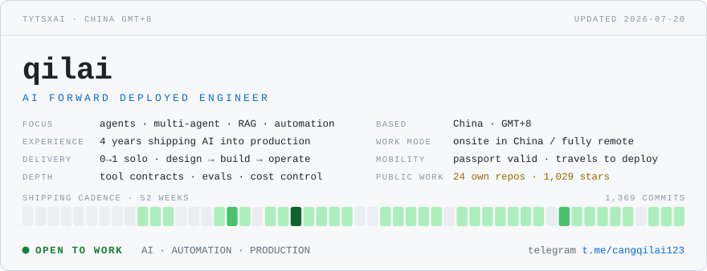
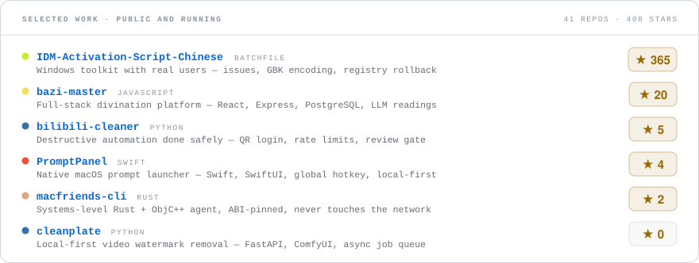
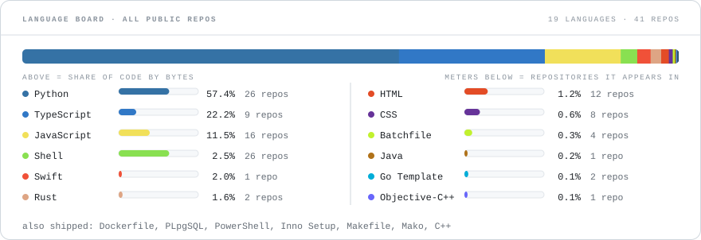

<!-- ============================================================ -->
<!-- qilai (tytsxai) — GitHub Profile                            -->
<!-- 这是技术名片，不是简历：只放卖点和能点开的证据。            -->
<!-- 经历时间线、公司口径、背景核验这些留在简历里，别搬过来。    -->
<!-- Contact: email only. Do not add phone / IM / social links.  -->
<!-- Every visual is generated by scripts/gen_assets.py          -->
<!-- ============================================================ -->

  <picture>
    <source media="(prefers-color-scheme: dark)" srcset="assets/hero-dark.svg" />
    
  </picture>

  <b>研发交付工程师 / AI 落地交付</b> 
  Python · TypeScript · JavaScript · Rust · Swift · Java · Shell · SQL 
  把 AI 接进真实业务流程，做成能上线、能排障、能交给别人跑下去的系统。

  <a href="mailto:wwtvn1937@gmail.com"><b>wwtvn1937@gmail.com</b></a> ·
  <a href="https://github.com/tytsxai?tab=repositories">全部仓库</a>

---

时区 GMT+8。工程经验约四年（2022.03 起），2023 年起把 AI 工程化落地到生产环境，目前可随时到岗，远程或驻场都行。

核心方向是把模型接到扛得住生产的地方：Agent 工作流、Tool Calling、结构化输出，MCP / RAG 以接入落地为主，不做算法研究；失败可重试、过程可回查、异常留有人工接管路径。主要积累在异步系统的状态机与幂等设计——模型 API、三方平台、链上接口这类外部依赖，通常做成可重试、可回放、可排障的模块，涉及状态一致性与补偿审计。检索方向做过全文 + 向量混合召回、分数融合与 rerank、中文分词与相似去重，后续的 RAG 知识库检索层沿用了这条链路。

交付覆盖接口、库表、React 页面、Docker 部署、GPU 环境上的模型服务与线上排障，通常一人负责到底。节奏上先用一到两周产出可用版本，再补齐幂等、重试、人工接管与回滚，随交付附带验收清单、Runbook 和部署脚本。

公司内部项目包括 AI 自动化运营平台、内容生产线、AI 图像处理平台与中文混合检索系统；源码不对外公开，架构与技术选型可在沟通中展开。

<b>English</b>

 

**AI application & delivery engineer**, working in GMT+8. Roughly four years of engineering since 2022.03, AI in production since 2023. Available immediately, onsite or remote.

Core focus: putting models where they have to survive production — agent workflows, tool calling, structured output, MCP and RAG as integration work rather than research — with retries, replayable state, and a human handoff for anything that can get stuck. Primary strength is async state machines and idempotency: model APIs, third-party platforms and chain interfaces turned into modules that can be retried, replayed and debugged. On the retrieval side: full-text + vector hybrid recall, score fusion, rerank; a later RAG pipeline reused the same recall layer.

Delivery covers API and schema design, the React front end, Docker deployment, GPU model serving, and on-call debugging — usually end to end. Typical pace: a usable version in a week or two, then idempotency, retries, human takeover and rollback, shipped with an acceptance checklist, a runbook and deploy scripts. In-house work has included an AI automation platform, a content pipeline, an image-processing platform and a Chinese hybrid search system; source stays private, architecture is open to discuss.

Contact: **wwtvn1937@gmail.com** — the only channel on this profile.

---

  <picture>
    <source media="(prefers-color-scheme: dark)" srcset="assets/stack-dark.svg" />
    
  </picture>

---

公开、可运行、在维护。下面的星标与语言数据由 CI 每周从 GitHub API 刷新。

| 仓库 | 一句话 |
| --- | --- |
| [**IDM-Activation-Script-Chinese**](https://github.com/tytsxai/IDM-Activation-Script-Chinese) | Windows 批处理工具集 · GPL-3.0。有真实用户量的分发与维护：issue 承接、GBK / CP936 编码坑、注册表自动备份、失败可回退 |
| [**cleanplate**](https://github.com/tytsxai/cleanplate) | 本地优先的 AI 视频去水印后端 · FastAPI + ComfyUI DiffuEraser，FFmpeg 降级。异步 job 架构与模型服务化的公开版本 |
| [**PromptPanel**](https://github.com/tytsxai/PromptPanel) | macOS 提示词与片段启动器 · Swift / SwiftUI，本地优先、全局快捷键。文档、CI、单测、发布与恢复流程全部走完 |
| [**bilibili-cleaner**](https://github.com/tytsxai/bilibili-cleaner) | 账号批量清理 · FastAPI + Web UI + CLI + Docker。破坏性自动化怎么做得住：扫码登录、限速、复核门、pytest CI |
| [**macfriends-cli**](https://github.com/tytsxai/macfriends-cli) | macOS 微信好友关系检测 · Rust + ObjC++ agent。系统层深度：原生 agent、ABI 锁版逆向、纯本地不联网 |
| [**bazi-master**](https://github.com/tytsxai/bazi-master) | 全栈命理平台 · React + Express + PostgreSQL + Prisma。LLM 进产品：解读流水线、多模块领域逻辑、全栈自持 |

  <picture>
    <source media="(prefers-color-scheme: dark)" srcset="assets/work-dark.svg" />
    
  </picture>

  <picture>
    <source media="(prefers-color-scheme: dark)" srcset="assets/languages-dark.svg" />
    
  </picture>

  字节占比说明代码量落在哪儿，仓库覆盖数说明这门语言真正被用在多少个项目里——只看字节会得出「写 Python 的」这个结论，而字节占比垫底的 Swift 是一整个原生 macOS 应用。 每张图都由 <a href="scripts/gen_assets.py">scripts/gen_assets.py</a> 从 API 生成、<a href=".github/workflows/charts.yml">CI</a> 每周刷新；不挂第三方卡片服务，那些服务限流后会渲染成裂图。

---

**[wwtvn1937@gmail.com](mailto:wwtvn1937@gmail.com)** —— 本主页唯一的联系方式。

邮件里说明要解决的问题即可，比发 JD 更有效；通常一到两封邮件内能确认是否能接、大致方案与所需前提。

Email **wwtvn1937@gmail.com** — the only contact channel here. A problem description works better than a job description.

  AI 只有活过生产环境才算数；自动化只有还在控制之内才算数。

