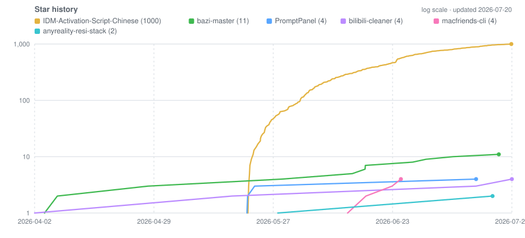

<!-- ============================================================ -->
<!-- qilai (tytsxai) — GitHub Profile README                     -->
<!-- AI Forward Deployed Engineer · Agent Systems · 0→1 Delivery -->
<!-- ============================================================ -->

<h1 align="center">qilai · AI Forward Deployed Engineer</h1>

<h3 align="center">Agents &amp; Multi-Agent Systems · RAG · LLM Applications · Automation at Scale</h3>

  <i>I take AI from a whiteboard idea to a production system that a real business runs on — design, build, deploy, operate.</i> 
  <i>把 AI 从方案设计一路做到生产落地并长期稳定运行：0→1 独立负责，交付即可用。</i>

  
  

  
  
  
  
  

  👋 <a href="#-about--简介">About</a> ·
  ⭐ <a href="#-portfolio-highlights--代表作">Portfolio</a> ·
  🧠 <a href="#-what-i-actually-ship--能交付什么">Capabilities</a> ·
  🧭 <a href="#-how-i-deliver--交付方式">How I Deliver</a> ·
  📬 <a href="#-contact--联系方式">Contact</a>

---

## 👋 About · 简介

| | |
| --- | --- |
| 🧑‍💻 **Who** | Born in the 2000s（00 后），4 years of hands-on AI engineering — shipped systems, not slideware |
| 📍 **Where** | Based in China (GMT+8) · work with teams onsite and remote |
| 🎯 **Focus** | AI application delivery: agents & multi-agent orchestration, RAG, LLM products, intelligent automation |
| 🚀 **How I work** | End to end, solo when it needs to be: solution design → build → deploy → operate. Multiple production systems running stably |
| 🧰 **Depth** | Tool contracts, evals, observability, cost control, runbooks — the parts that decide whether a system survives production |
| 💰 **Mindset** | Frontier tech **with a cost ceiling** — token and infra spend is a first-class requirement, not an afterthought |
| 📬 **Reach me** | Telegram [**@cangqilai123**](https://t.me/cangqilai123) (fastest) · [Email](mailto:wwtvn1937@gmail.com) |

<b>中文简介（点击展开）</b>

 

00 后，在国内（GMT+8），**4 年 AI 实战经验**。擅长从 0 到 1 独立负责，从方案设计一直做到生产落地并长期稳定运行，已交付多个在跑的系统。

主要方向：Agent 编排与多 Agent 协作、RAG 检索增强、LLM 应用产品化、智能自动化矩阵。工程上更看重那些决定系统能不能扛住生产的部分——工具契约、评测、可观测性、成本控制、运行手册。注重前沿技术与成本的平衡，把 token 和基础设施开销当成一等需求而不是事后优化。

有具体问题要解决，直接私信：Telegram [@cangqilai123](https://t.me/cangqilai123)。

---

## 🛰️ Where I add value · 我擅长的地方

The interesting work is where the model meets someone's messy reality. That gap is what I've spent four years closing.

| The hard part | How I handle it | Proof you can read |
| --- | --- | --- |
| **Finding the real workflow** | Start from the operator's critical path and failure modes, not from the model | Every repo below starts with a concrete workflow, not a demo |
| **Getting a working system in days, not quarters** | 0→1 solo delivery: design → MVP → docs → CI → production | 29 public repos, most shipped end to end alone |
| **Surviving contact with production** | Dry runs, review gates, rate limits, retries, rollback paths, structured logs | [bilibili-cleaner](https://github.com/tytsxai/bilibili-cleaner), [x-account-cleaner](https://github.com/tytsxai/x-account-cleaner) |
| **Keeping unit economics sane** | Model routing, caching, batching, prompt/context budgeting, cheap-model-first tiering | Agent harnesses & automation pipelines I run daily |
| **Handing it over so it keeps running** | Bilingual runbooks, deploy scripts, systemd/CI, redaction gates, upgrade notes | [anyreality-resi-stack](https://github.com/tytsxai/anyreality-resi-stack) |
| **Working across language & culture** | Native Chinese, working English, bilingual docs as a default habit | Most repos ship zh-CN + EN READMEs |

---

## ⭐ Portfolio Highlights · 代表作

Public, runnable, and maintained. Stars are real users, not follows.

| Project | What it is | What it proves |
| --- | --- | --- |
| [**IDM-Activation-Script-Chinese**](https://github.com/tytsxai/IDM-Activation-Script-Chinese)  | Windows batch toolkit, GPL-3.0, ~1k stars, 70+ forks | Real distribution & maintenance at scale — issues, encoding hell (GBK/CP936), registry backup, self-check |
| [**PromptPanel**](https://github.com/tytsxai/PromptPanel)  | macOS prompt/snippet launcher for AI power users (Swift/SwiftUI) | Product thinking for the LLM workflow itself · local-first UX · release-readiness CI |
| [**bilibili-cleaner**](https://github.com/tytsxai/bilibili-cleaner)  | Bulk account cleanup — FastAPI + Web UI + Typer CLI + Docker | Destructive automation done **safely**: QR login, rate limits, review gates, pytest CI |
| [**macfriends-cli**](https://github.com/tytsxai/macfriends-cli)  | WeChat relationship detection on macOS (Rust + ObjC++ agent) | Systems depth: native agent, ABI-pinned reverse work, strictly local execution |
| [**anyreality-resi-stack**](https://github.com/tytsxai/anyreality-resi-stack)  | Self-hosted sing-box infra: installer, subscription server, dual-node routing | Infra & ops delivery: bilingual runbook, systemd, secret-redaction CI, GPL-3.0 |
| [**bazi-master**](https://github.com/tytsxai/bazi-master)  | Full-stack AI divination platform (React + Express + PostgreSQL + Prisma) | LLM-in-product: interpretation pipelines, multi-module domain logic, full-stack ownership |
| [**x-account-cleaner**](https://github.com/tytsxai/x-account-cleaner) | Local-first X/Twitter cleanup CLI (TypeScript + Playwright) | Browser automation with a review-first, irreversible-action-aware model |
| [**telegram-ui-builder**](https://github.com/tytsxai/telegram-ui-builder) · [live demo](https://tytsxai.github.io/telegram-ui-builder/) | Visual designer for bot messages, inline keyboards, multi-screen flows | Developer-facing tooling with a deployed demo and Pages CI |

> 🔒 A meaningful share of my work is private client / production systems (agent pipelines, ops automation, data workflows). Happy to walk through architecture and trade-offs in a call.
> 🔒 相当一部分是私有生产项目，方案与取舍可在沟通中详聊。

---

## 🧠 What I Actually Ship · 能交付什么

<table>
<tr><td width="50%" valign="top">

### 🤖 Agents & Multi-Agent
- Tool contracts, function calling, **MCP** servers/clients
- Planner → executor → verifier decomposition
- Multi-agent orchestration: fan-out, pipelines, adversarial review
- Human-in-the-loop gates on irreversible actions
- Memory, state, resumability, failure recovery

</td><td width="50%" valign="top">

### 📚 RAG & Knowledge
- Chunking, hybrid retrieval, reranking, citation grounding
- Vector DB + graph/structured hybrid retrieval
- Knowledge graphs over code and documents
- Freshness, dedup, and eval-driven retrieval tuning

</td></tr>
<tr><td width="50%" valign="top">

### ⚙️ Intelligent Automation
- Automation matrices across accounts, channels, sites
- Scheduling, queues, idempotency, retries, backoff
- Browser/API automation with safety boundaries
- Structured logs, metrics, alerting into Telegram/Slack

</td><td width="50%" valign="top">

### 💸 Reliability & Cost
- Model routing & cheap-model-first tiering
- Prompt/context budgeting, caching, batching
- Evals & regression gates before rollout
- Runbooks, rollback paths, on-call-able ops

</td></tr>
</table>

---

## 🧭 How I Deliver · 交付方式

- 🎯 **Start from the workflow, not the model.** Who runs it, what breaks, what "done" means in their numbers.
- 🧪 **Smallest useful loop first.** A runnable thin slice in days, then harden from the friction that actually shows up.
- 🛡️ **Treat risky actions as first-class.** Dry run, confirm, limit, log, roll back — visible failure beats silent failure.
- 📏 **Measure before claiming.** Evals, reproduction steps, and real runs. "Verified" and "should work" are different words.
- 📚 **Package for the next person.** Docs, deploy scripts, CI, and runbooks so it outlives my involvement.
- 🔁 **Iterate from evidence.** Issues, traces, cost dashboards, user confusion — not vibes.

---

## 🧰 Tech Stack · 技术栈

**Core:** Python · TypeScript · Rust · Swift · React/Next.js · FastAPI · Node.js · PostgreSQL · Redis · Docker · Linux

**AI / LLM**

  
  
  
  
  
  
  
  
  
  
  
  

**Languages &amp; Runtime**

  

**Web &amp; Data**

  

**Infra &amp; Ops**

  

---

## 📈 Snapshot

  
  
  
  

  <picture>
    <source media="(prefers-color-scheme: dark)" srcset="assets/star-history-dark.svg" />
    
  </picture>

  <picture>
    <source media="(prefers-color-scheme: dark)" srcset="assets/languages-dark.svg" />
    
  </picture>

  Charts are generated from the GitHub API by <a href="scripts/gen_charts.py">scripts/gen_charts.py</a> and refreshed weekly by <a href=".github/workflows/charts.yml">CI</a> — self-hosted on purpose, so nothing here breaks when a third-party card service is rate-limited.

---

## 📬 Contact · 联系方式

  
  
  
  
  

**Fastest response: Telegram [@cangqilai123](https://t.me/cangqilai123).** Send the problem — I'll tell you within a message or two whether I can actually solve it and roughly how.

**最快联系方式：Telegram [@cangqilai123](https://t.me/cangqilai123)。** 直接说要解决什么问题就行，我会告诉你能不能做、大概怎么做。

  <i>✨ AI is only valuable when it survives production. Automation is only valuable when it stays under control. ✨</i> 
  AI 要能扛住生产环境才有价值；自动化要始终可控才有价值。

