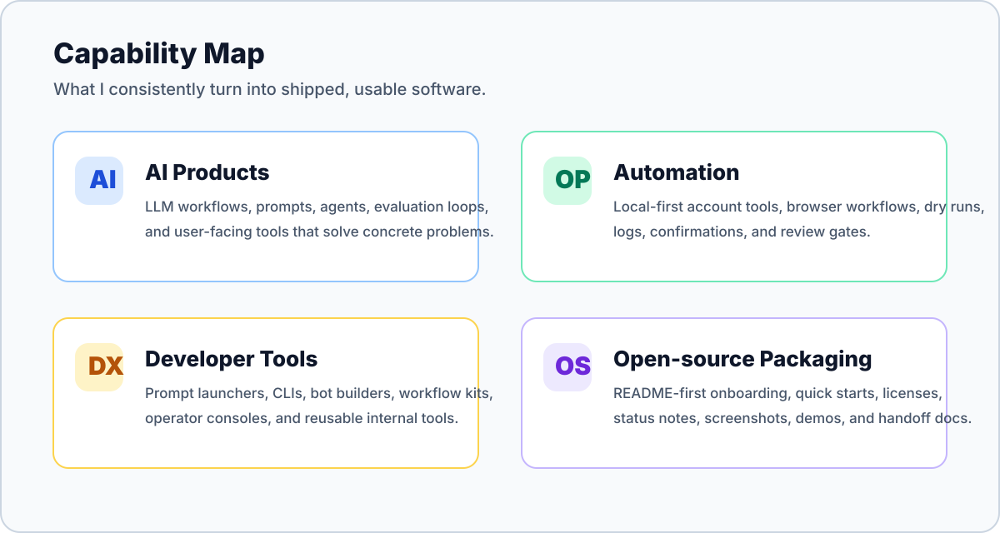

<!-- ============================================================ -->
<!-- qilai (tytsxai) — GitHub Profile README -->
<!-- AI products · automation systems · developer tools -->
<!-- ============================================================ -->

  <b>AI Product Engineer · Automation Systems · Developer Tools</b>
   
  I turn messy workflows into runnable products, local-first automation, and practical open-source tools.

  
  
  
  
  

  <a href="#engineering-profile">Engineering Profile</a> ·
  <a href="#how-i-build">How I Build</a> ·
  <a href="#open-source-evidence">Open Source Evidence</a> ·
  <a href="#stack">Stack</a>

---

## Engineering Profile

  

| Signal | What it means in practice |
| --- | --- |
| **Product sense** | I look for the smallest useful loop first: user entry point, critical path, failure mode, and reason to come back. |
| **Engineering depth** | I can move across frontend, backend, CLI, local desktop workflows, automation, docs, and deployment boundaries. |
| **Operational judgment** | For tools that touch real accounts or data, I bias toward dry runs, confirmations, logs, recovery notes, and explicit limits. |
| **Packaging discipline** | A project is not finished until a new visitor can understand what it does, run it, and know its current safety/status boundary. |

## How I Build

| Stage | My default bar |
| --- | --- |
| **Find the real problem** | Identify the workflow pain, user entry point, failure mode, and the smallest useful product loop. |
| **Ship the first usable path** | Build the critical path first, keep setup reproducible, and avoid decorative complexity. |
| **Harden the risky parts** | Add dry runs, explicit confirmations, logs, error messages, config checks, and recovery notes where the tool can affect real accounts or data. |
| **Make it maintainable** | Keep docs, runbooks, quick starts, and project status aligned with what the code actually supports. |
| **Iterate from evidence** | Treat stars, issues, user friction, runtime failures, and real usage as stronger signals than abstract polish. |

## Open Source Evidence

These repos are evidence, not the headline. The headline is the ability to turn a real workflow into a usable tool.

| Capability shown | Representative repos | Why it matters |
| --- | --- | --- |
| **AI product + DX** | [PromptPanel](https://github.com/tytsxai/PromptPanel), [bazi-master](https://github.com/tytsxai/bazi-master), [ecommerce-product-image-workflow](https://github.com/tytsxai/ecommerce-product-image-workflow/) | Turns AI usage into concrete workflows, not just prompts or demos. |
| **Safety-first automation** | [bilibili-cleaner](https://github.com/tytsxai/bilibili-cleaner), [x-account-cleaner](https://github.com/tytsxai/x-account-cleaner), [macfriends-cli](https://github.com/tytsxai/macfriends-cli) | Automates repetitive account work while keeping review and local control visible. |
| **Builder tooling** | [telegram-ui-builder](https://github.com/tytsxai/telegram-ui-builder), [codex-app-account-switcher](https://github.com/tytsxai/codex-app-account-switcher), [codex-bridge](https://github.com/tytsxai/codex-bridge) | Reduces repeated setup and makes technical workflows easier to operate. |
| **Practical utilities** | [IDM-Activation-Script-Chinese](https://github.com/tytsxai/IDM-Activation-Script-Chinese), [reality-resi-stack](https://github.com/tytsxai/reality-resi-stack), [lab-starnode](https://github.com/tytsxai/lab-starnode) | Solves concrete user problems with docs, scripts, and maintainable packaging. |

  

## Stack

  

| Layer | Tools and habits |
| --- | --- |
| **AI / LLM** | OpenAI, Claude, prompt systems, agent workflows, RAG patterns, evaluation thinking |
| **Product** | React, Next.js, Vite, Tailwind, SwiftUI, FastAPI, Node.js, PostgreSQL, Redis |
| **Automation** | Playwright, shell tooling, local-first CLIs, desktop workflows, browser-assisted operations |
| **Operations** | Docker, GitHub Actions, health checks, runbooks, release notes, rollback-friendly changes |

## Repository Quality Standard

Every serious public project should make the visitor quickly understand:

- what problem it solves
- how to run it
- whether it is usable, beta, experimental, or archived
- what the safety boundary is
- where the demo, screenshots, docs, or quick start live
- how the project is licensed and maintained

## Star History

  

## Contact

  
  
  

  Open to practical collaboration around AI products, developer automation, local-first utilities, and operator-facing open source.
   
  Repository count is dynamic because the open-source portfolio keeps growing.

