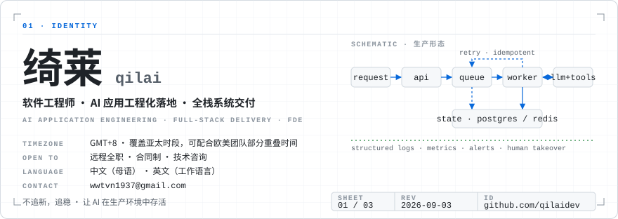
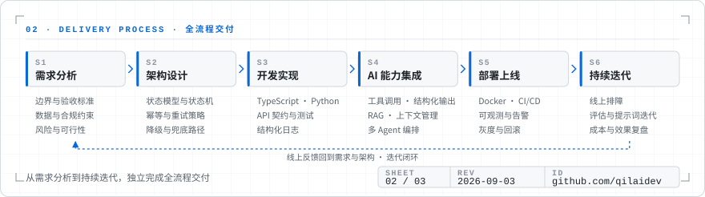

<!--
  qilaidev / 绮莱 — GitHub 主页
  · 三张图由 scripts/gen_assets.py 生成，CI 每周一刷新；正文不写任何会随时间漂移的数字。
  · 联系方式只放邮箱。
-->

  <picture>
    <source media="(prefers-color-scheme: dark)" srcset="assets/identity-dark.svg" />
    
  </picture>

绮莱（qilai），软件工程师，常驻 GMT+8 时区，开放远程全职、合同制及技术咨询机会。联系邮箱：[wwtvn1937@gmail.com](mailto:wwtvn1937@gmail.com)。

专注 AI 应用工程化落地与全栈系统交付，具备 4 年 AI 落地实战经验，覆盖 LLM 应用、AI Agent、多 Agent 系统与智能自动化，可独立完成从需求分析、架构设计、开发实现、AI 能力集成、部署上线到持续迭代的全流程交付，并有真实生产环境项目经验。

当前重点方向：AI FDE（Forward Deployed Engineering）、AI 应用工程、企业级 AI Agent、多 Agent 系统与智能自动化。同时进行独立研发与提示词工程实践，正在将过去 4 年的 AI 落地经验沉淀为可复用的工程模板与 Agent 构建范式。

## 交付流程

  <picture>
    <source media="(prefers-color-scheme: dark)" srcset="assets/process-dark.svg" />
    
  </picture>

## 核心能力

| 领域 | 内容 |
| --- | --- |
| LLM 与 Agent | 工具调用、结构化输出、上下文管理、RAG、任务编排、多 Agent 协作 |
| 工程实践 | 状态持久化、异步状态机、幂等重试机制、异常兜底 |
| 交付目标 | 可承受实际流量、可观测、易排障的系统 |
| 交付范围 | 需求分析、架构设计、开发实现、AI 能力集成、部署上线、持续迭代 |

## 技术栈

技术选型不追求新颖性，优先考虑稳定性、可维护性、成本与业务回报。

| 层 | 主力 | 也在用 |
| --- | --- | --- |
| 语言 | TypeScript、Python | Rust、Swift、Shell |
| 前端与客户端 | React、Electron | Vite、Tailwind CSS、SwiftUI、浏览器扩展 |
| 后端 | FastAPI、Node.js / Express | Prisma、SQLAlchemy、Typer / 程序化 CLI |
| 数据 | PostgreSQL、Redis | SQLite（WAL）、全文与向量检索 |
| AI / LLM | Anthropic API、OpenAI API、MCP、工具调用、结构化输出、RAG、多 Agent 编排 | Provider 抽象与 mock 回退、ComfyUI 工作流、本地推理 |
| 基础设施 | Docker、GitHub Actions、Linux、Nginx | Cloudflare Workers / Tunnel、自托管部署 |
| 质量 | pytest、Vitest、Playwright、类型检查与 lint 门禁 | OpenAPI 契约快照、CHANGELOG 与 llms.txt |

## 工程原则

- 不追新，追稳。
- 构建有韧性的系统，让 AI 在生产环境中存活。
- 把混沌拆成系统，把系统交给机器。

## 项目

精选项目见 GitHub 置顶仓库。下表把上面的能力主张对应到可以直接阅读的代码：

| 主张 | 仓库 | 说明 |
| --- | --- | --- |
| 异步任务队列、worker 解耦、Provider 降级 | [cleanplate](https://github.com/qilaidev/cleanplate) | FastAPI + 独立 worker 执行 AI 视频去水印，AI 主链不可用时回退到 FFmpeg，链路可验证 |
| LLM 解读流水线、Provider 抽象、全栈交付 | [bazi-master](https://github.com/qilaidev/bazi-master) | React + Express + Prisma + PostgreSQL + Redis，mock / OpenAI / Anthropic 可切换，五种界面语言 |
| 无状态计算引擎，HTTP API + CLI + MCP 三种接入 | [metaphysics-engine](https://github.com/qilaidev/metaphysics-engine) | 纯计算、无数据库，OpenAPI 契约由 CI 守快照，可作为 Agent 工具直接接入 |
| Agent 可调用的命令面，风控优先 | [quant-agent-cli](https://github.com/qilaidev/quant-agent-cli) | JSON Schema 输入、结构化错误码、dry-run / testnet 门禁，实盘写路径默认封死 |
| 自然语言驱动的本机工具调用 | [mac-machina](https://github.com/qilaidev/mac-machina) | 本地 Bridge 执行数十个系统工具，Agent 层可选跑在 Cloudflare Worker |
| 多 Agent 并行执行与结果对比 | [async-code](https://github.com/qilaidev/async-code) | 上游项目的衍生作品：Docker 隔离并行跑 Claude Code 与 Codex CLI，产出可审查的 patch |
| 批量操作的复核门、限速与幂等 | [bilibili-cleaner](https://github.com/qilaidev/bilibili-cleaner) · [x-account-cleaner](https://github.com/qilaidev/x-account-cleaner) | 列出 → 本地筛选 → 人工复核 → 选择性删除，Web UI / API / CLI 三种入口 |
| 原生 macOS 工具，本地优先 | [PromptPanel](https://github.com/qilaidev/PromptPanel) | Swift / SwiftUI 全局快捷键片段启动器，纯本地存储 |
| 面向大量真实用户的 Windows 脚本 | [IDM-Activation-Script-Chinese](https://github.com/qilaidev/IDM-Activation-Script-Chinese) | GBK 编码适配、注册表备份与回退 |

## 活动

  <picture>
    <source media="(prefers-color-scheme: dark)" srcset="assets/activity-dark.svg" />
    
  </picture>

## 工作偏好

可接受远程全职、合同制或技术咨询，偏好与产品、业务紧密协作的小团队或独立交付场景。常驻 GMT+8，可覆盖亚太时段，也可配合欧美团队的部分重叠时间。工作语言：中文（母语）、英文（可作为工作语言）。

其他长期关注与兴趣：AI Agent、元宇宙、密码学；哲学、物理、科幻、修仙、山野。不跟世界比赛，慢慢品味这一生。

## English

**qilai (绮莱)** — software engineer based in GMT+8, open to remote full-time, contract, and consulting work. Email: [wwtvn1937@gmail.com](mailto:wwtvn1937@gmail.com).

Focused on putting AI applications into production and delivering full-stack systems: 4 years of hands-on AI delivery across LLM applications, AI agents, multi-agent systems, and intelligent automation, owning the whole cycle from requirements and architecture through implementation, AI integration, deployment, and iteration, with real production experience. Current focus: AI forward deployed engineering, AI application engineering, enterprise AI agents, multi-agent systems, and automation.

- **LLM & agents**: tool calling, structured output, context management, RAG, task orchestration, multi-agent collaboration.
- **Engineering**: state persistence, async state machines, idempotent retries, failure fallbacks. The goal is a system that survives real traffic, is observable, and is easy to debug.
- **Stack**: TypeScript, React, Electron, Python, FastAPI, PostgreSQL, Redis. Choices favour stability, maintainability, cost, and return over novelty.
- **Principles**: stability over novelty; build resilient systems so AI survives production; break chaos into systems, then hand the systems to machines.

Prefers small teams or independent delivery with close product and business collaboration. Covers APAC hours and can overlap partially with US and European teams. Working languages: Chinese (native) and English.

## 联系

讨论相关机会或技术交流，欢迎邮件联系 [wwtvn1937@gmail.com](mailto:wwtvn1937@gmail.com)。
